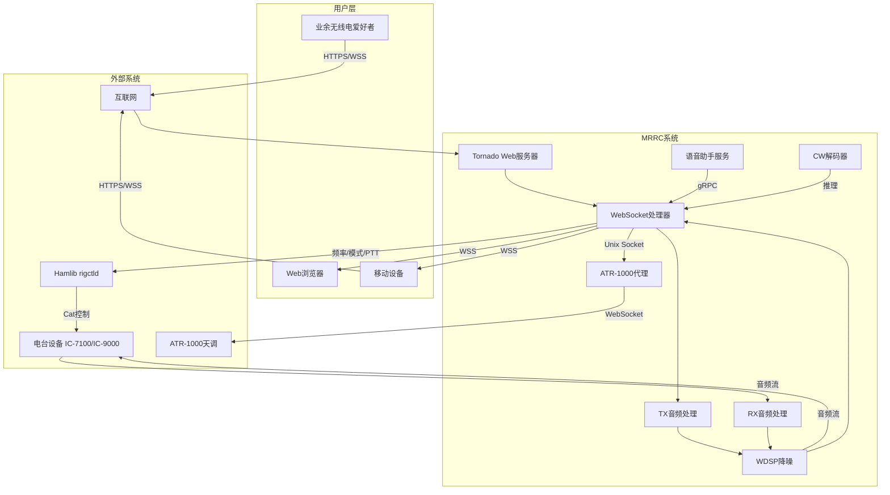
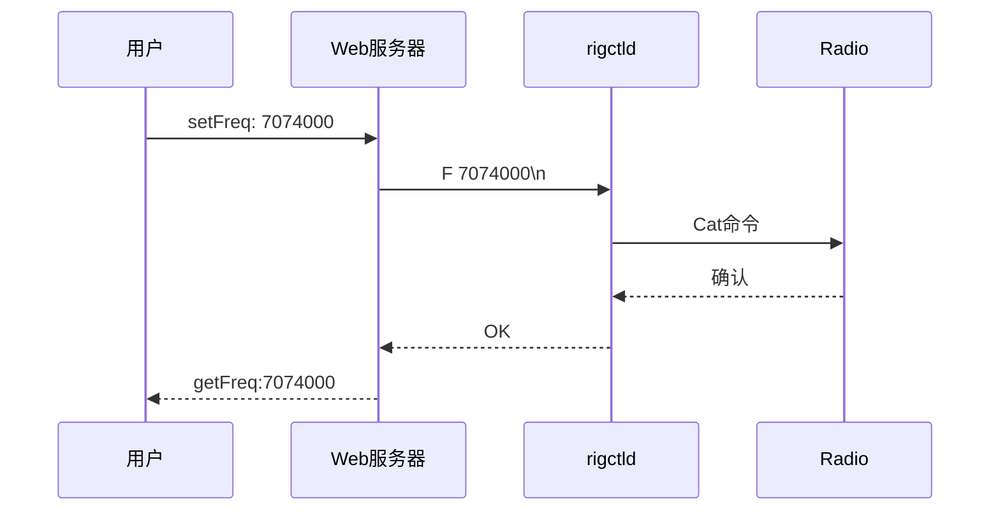
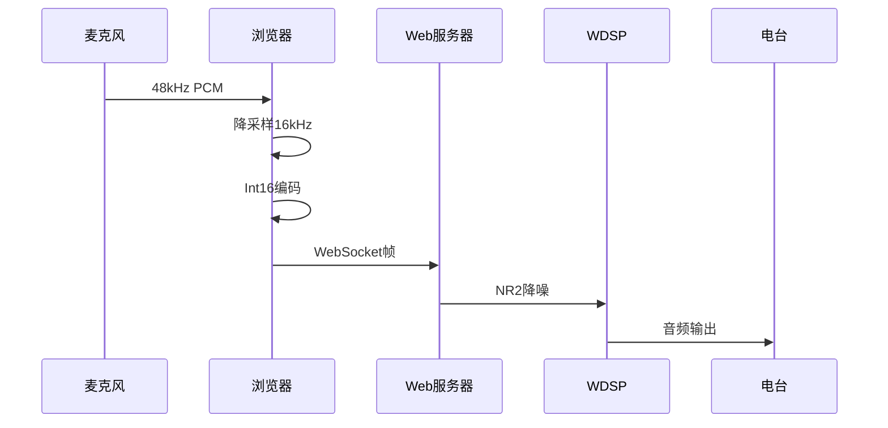
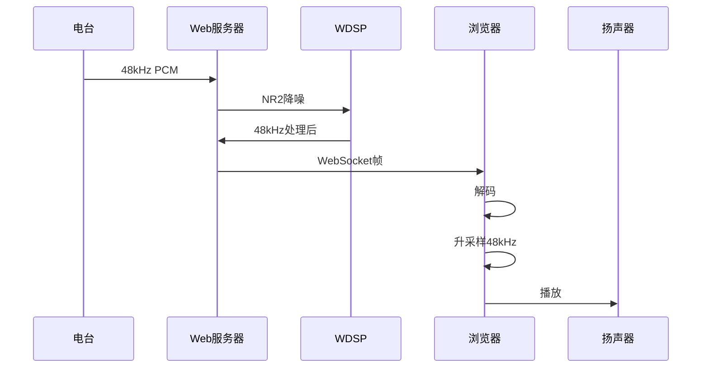
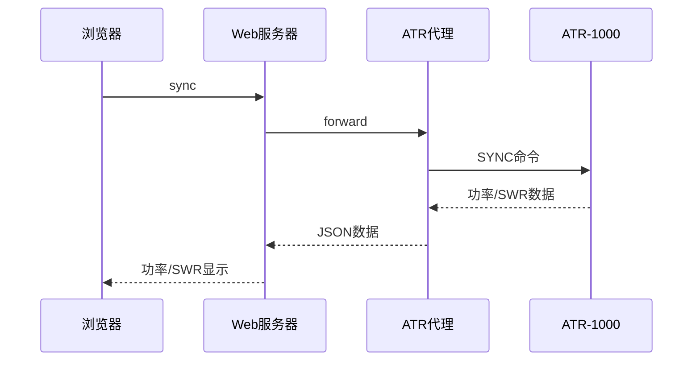
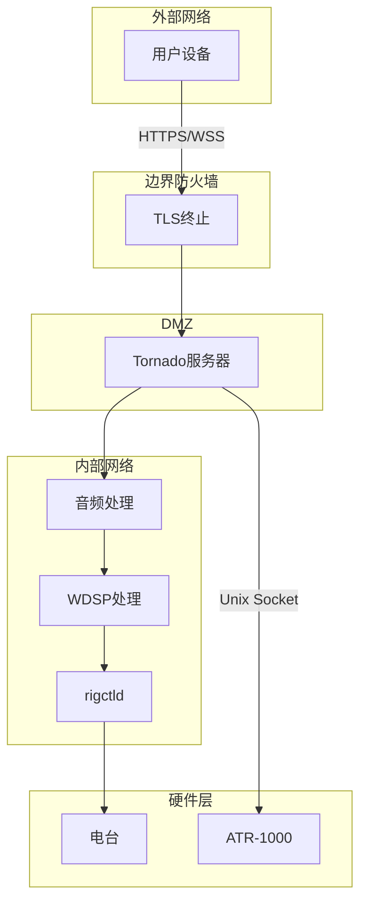

# MRRC 系统上下文

> 基于 Vibe-SDD 方法论的系统上下文图和外部实体

---

## 1. 系统上下文图



---

## 2. 外部实体说明

### 2.1 用户 (User)

| 实体 | 描述 | 接口 |
|------|------|------|
| HAM | 业余无线电爱好者 | HTTPS/WSS |
| Mobile | 移动端用户 | HTTPS/WSS |

**职责**:
- 发起控制请求
- 提供麦克风输入
- 接收音频输出
- 查看仪表显示

### 2.2 电台 (Radio)

| 实体 | 描述 | 接口 |
|------|------|------|
| IC-7100 | Icom业余电台 | USB Cat控制 |
| IC-R9000 | Icom接收机 | USB Cat控制 |
| 其他电台 | Hamlib支持 | 串口/USB |

**职责**:
- 频率/模式控制
- 音频输入/输出
- PTT控制
- S表数据提供

### 2.3 天调 (ATR-1000)

| 实体 | 描述 | 接口 |
|------|------|------|
| ATR-1000 | 自动天调 | WebSocket |

**职责**:
- 功率测量
- SWR监测
- 自动调谐
- 存储学习参数

### 2.4 Hamlib

| 实体 | 描述 | 接口 |
|------|------|------|
| rigctld | Hamlib守护进程 | TCP:4532 |

**职责**:
- 电台控制协议转换
- 频率/模式同步
- S表数据读取

---

## 3. 数据流设计

### 3.1 控制数据流



### 3.2 TX音频数据流



### 3.3 RX音频数据流



### 3.4 ATR-1000数据流



---

## 4. 边界接口定义

### 4.1 用户接口 (User Interface)

| 接口 | 协议 | 描述 |
|------|------|------|
| Web界面 | HTTPS | 静态HTML/CSS/JS |
| 控制API | WSS | JSON格式控制命令 |
| 音频流 | WSS | 二进制音频帧 |

**接口格式**:

```json
// 控制命令
{"action": "setFreq", "data": "7074000"}
{"action": "setMode", "data": "USB"}
{"action": "ptt", "data": true}

// 响应
{"action": "getFreq", "data": "7074000"}
{"action": "getMode", "data": "USB"}
```

### 4.2 电台接口 (Radio Interface)

| 接口 | 协议 | 描述 |
|------|------|------|
| Cat控制 | 串口/USB | Icom CI-V协议 |
| 音频输入 | 3.5mm | 电台AF输出 |
| 音频输出 | 3.5mm | 电台MIC输入 |
| PTT控制 | 电台ACC | 发射控制 |

### 4.3 ATR-1000接口

| 接口 | 协议 | 描述 |
|------|------|------|
| 控制 | WebSocket | JSON帧格式 |
| 端口 | TCP:60001 | 网络连接 |

---

## 5. 安全性边界



**安全措施**:
- TLS 1.2+ 加密传输
- 用户认证 (密码/证书)
- 防火墙端口限制
- Unix Socket进程隔离

---

**文档信息**
- 版本: 1.0
- 创建日期: 2026-03-15
- 最后更新: 2026-03-15
- 作者: MRRC Team
