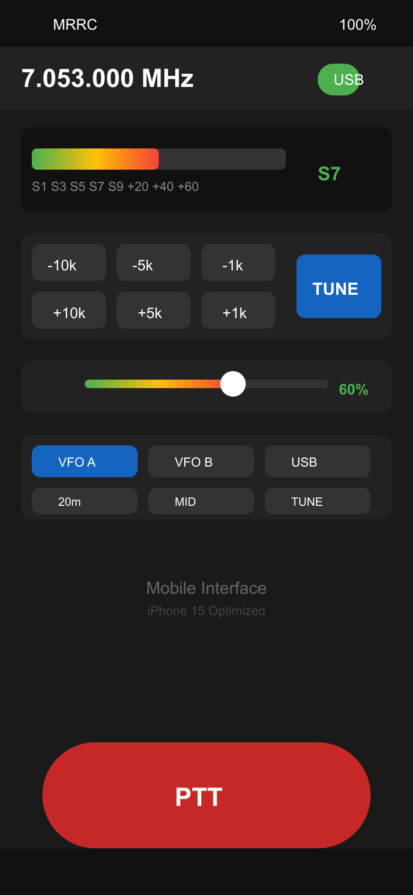
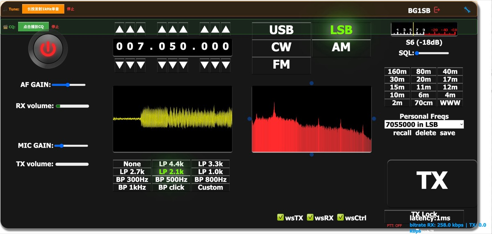

# Mobile Remote Radio Control (MRRC)

[](README_en.md)
[](README_CN.md)

---

**Amateur Radio, Anytime, Anywhere.**

**随时随地，畅享业余无线电。**

A modern web-based remote control system optimized for mobile devices, enabling flexible operation of your amateur radio station from anywhere.

基于现代Web技术的远程电台控制系统，专为移动端优化，让您随时随地灵活操控业余电台。

---

## 📸 Screenshots / 界面展示

<table>
  <tr>
    <td align="center" width="50%">
      <h3>📱 Mobile Interface</h3>
      
      <br>
      <sub>iPhone 15 Optimized</sub>
    </td>
    <td align="center" width="50%">
      <h3>🖥️ Desktop Interface</h3>
      
      <br>
      <sub>Full-featured Control Panel</sub>
    </td>
  </tr>
</table>

> **Mobile**: Modern mobile UI optimized for iPhone/Android with touch-friendly controls, large PTT button, and real-time S-meter display.
>
> **Desktop**: Full-featured desktop interface with spectrum display, detailed controls, and comprehensive radio management.

---

## 🌐 Select Language / 选择语言

| Language | Description |
|----------|-------------|
| [**English**](README_en.md) | Documentation in English |
| [**中文**](README_CN.md) | 中文文档 |

---

## ✨ Key Features / 核心特性

| Feature | Description |
|---------|-------------|
| 📱 **Mobile First** | Optimized for iPhone/Android with touch-friendly UI |
| 🎛️ **Full Control** | Frequency, mode, PTT - complete station control |
| 🎤 **Real-time Audio** | Bidirectional TX/RX streaming (16kHz) |
| 🌍 **Remote Anywhere** | Access your station from anywhere with internet |
| 🔒 **Secure Connection** | TLS encrypted HTTPS/WSS |
| ⚡ **Ultra Low Latency** | TX→RX switching < 100ms |
| 🎯 **One-Hand Operation** | PTT button optimized for mobile thumb reach |

---

## 📊 Performance / 性能指标

| Metric | Value |
|--------|-------|
| TX Latency | ~65ms |
| RX Latency | ~51ms |
| TX→RX Switch | <100ms |
| PTT Reliability | 99%+ |

---

## 🚀 Quick Start / 快速开始

```bash
# 1. Start rigctld
rigctld -m 335 -r /dev/cu.usbserial-230 -s 4800

# 2. Start MRRC Server
python ./UHRR

# 3. Access from mobile browser
# https://your-domain/mobile_modern.html
```

---

## 📁 Project Structure / 项目结构

```
MRRC/
├── www/           # Frontend (HTML5/JS/CSS)
│   ├── mobile_modern.html   # Mobile interface
│   ├── controls.js          # Audio & control logic
│   └── tx_button_optimized.js
├── UHRR           # Backend (Tornado + WebSocket)
├── certs/         # TLS certificates
├── docs/          # Documentation
├── dev_tools/     # Test utilities
└── nanovna/       # NanoVNA integration
```

---

## 📄 License / 许可证

[GNU General Public License v3.0](LICENSE)

Based on [F4HTB/Universal_HamRadio_Remote_HTML5](https://github.com/F4HTB/Universal_HamRadio_Remote_HTML5)

---

## 🔗 Links

- [English Documentation](README_en.md)
- [中文文档](README_CN.md)
- [Changelog](CHANGELOG.md)
- [System Architecture](docs/System_Architecture_Design.md)
