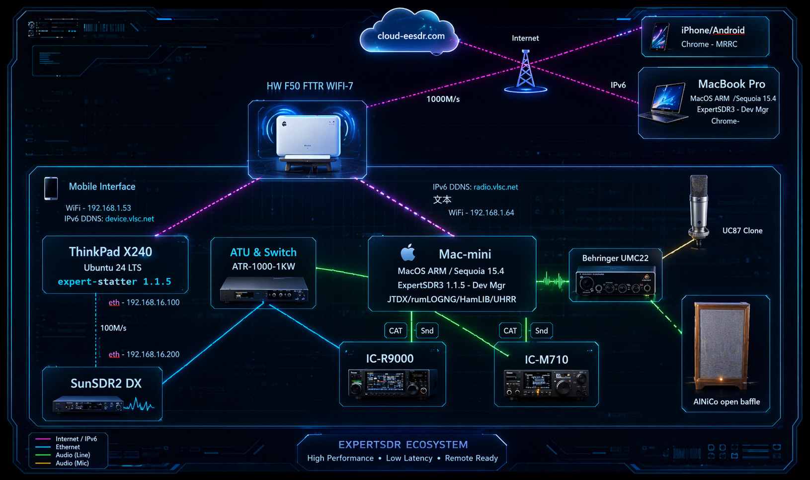
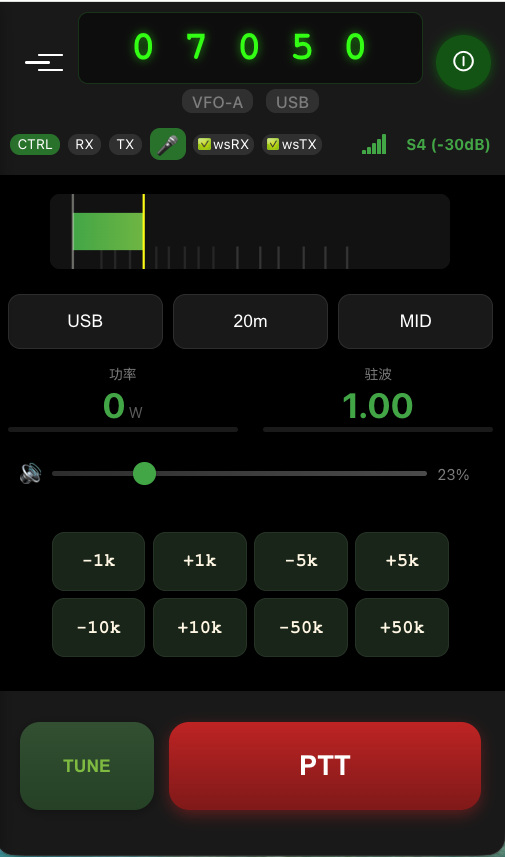

# Mobile Remote Radio Control (MRRC) V4.9.2

[](README_en.md)
[](README_CN.md)
[](CHANGELOG.md)

---

**Amateur Radio, Anytime, Anywhere.**

**随时随地，畅享业余无线电。**

A modern web-based remote control system optimized for mobile devices, enabling flexible operation of your amateur radio station from anywhere.

基于现代Web技术的远程电台控制系统，专为移动端优化，让您随时随地灵活操控业余电台。

> 🎉 **V4.9.2 更新**: 蓝色系UI风格改版、S表显示优化、CQ功能修复
>
> 历史版本: V4.9.0 语音助手、CW实时解码、SDR界面、多实例支持

---

## 🏗️ System Architecture / 系统架构

```
┌─────────────────────────────────────────────────────────────────────────┐
│                        Client Layer / 客户端层                           │
├───────────────────────────┬─────────────────────────────────────────────┤
│      Mobile Browser       │         External Software / API             │
│      移动端浏览器          │         外部软件 / API                       │
└─────────────┬─────────────┴──────────────────────┬──────────────────────┘
              │ HTTPS / WebSocket                  │ HTTP REST
              ▼                                    ▼
┌─────────────────────────────────────────────────────────────────────────┐
│                       Service Layer / 服务层                             │
├───────────────────────────┬─────────────────────────────────────────────┤
│      MRRC Main Program    │         ATR-1000 API Server                 │
│      MRRC 主程序           │         RESTful API (:8080)                 │
│                           │                                             │
│  • Radio Control          │  • /api/v1/status    Status query          │
│  • Audio TX/RX            │  • /api/v1/relay     Relay control         │
│  • User Auth              │  • /api/v1/tune      Quick tune            │
└─────────────┬─────────────┴──────────────────────┬──────────────────────┘
              │                                    │
              │ rigctld + Audio                    │ Unix Socket
              ▼                                    ▼
┌───────────────────────────┐         ┌─────────────────────────────────────┐
│       Radio Device        │         │     ATR-1000 Proxy / 天调代理        │
│       电台设备             │         │       atr1000_proxy.py              │
│                           │         │                                     │
│  • Freq/Mode (rigctld)    │         │  • Single device connection         │
│  • PTT Control            │         │  • Dynamic polling: 15s/5s/0.5s     │
│  • Audio TX/RX            │         │  • Smart Learning + Quick Tune      │
└───────────────────────────┘         └──────────────┬──────────────────────┘
                                                     │ WebSocket
                                                     ▼
                                     ┌─────────────────────────────────────┐
                                     │       ATR-1000 Tuner / 天调设备      │
                                     │                                     │
                                     │  • Power/SWR Display                │
                                     │  • Relay Params (SW/IND/CAP)        │
                                     └─────────────────────────────────────┘
```

**Key Points / 关键说明**:
- MRRC directly controls radio via rigctld + audio / MRRC 直接控制电台设备
- ATR-1000 Proxy only connects to tuner / 代理只连接天调设备

---

## 🏠 System Environment / 系统环境



> Complete MRRC system setup: Mobile device remote control station with ATR-1000 power meter and antenna tuner integration.

---

## 📸 Screenshots

### 📱 Mobile Interface



> Modern mobile UI optimized for iPhone/Android with touch-friendly controls, large PTT button, and real-time S-meter display.

---

### 🖥️ Desktop Interface


> Full-featured desktop interface with spectrum display, detailed controls, and comprehensive radio management.

---

## 🌐 Select Language / 选择语言

| Language | Description |
|----------|-------------|
| [**English**](README_en.md) | Documentation in English |
| [**中文**](README_CN.md) | 中文文档 |

---

## ✨ Key Features / 核心特性

| Feature | Description |
|---------|-------------|
| 📱 **Mobile First** | Optimized for iPhone/Android with touch-friendly UI |
| 🎛️ **Full Control** | Frequency, mode, PTT - complete station control |
| 🎤 **Real-time Audio** | Bidirectional TX/RX streaming (16kHz) |
| 🎙️ **AI Voice Assistant** | Whisper ASR + Qwen3-TTS synthesis |
| 📡 **CW Decoder** | ONNX real-time decoding, QSO state machine |
| 🎙️ **Audio Recording** | Record QSOs directly in browser (WAV/MP3) |
| 🌍 **Remote Anywhere** | Access your station from anywhere with internet |
| 🔒 **Secure Connection** | TLS encrypted HTTPS/WSS |
| ⚡ **Ultra Low Latency** | TX→RX switching < 100ms |
| 🎯 **One-Hand Operation** | PTT button optimized for mobile thumb reach |
| 🔧 **ATR-1000 Integration** | Smart tuner learning & quick tune |
| 🔌 **REST API** | Standalone API for external software integration |
| 🚀 **Remote Start** | SSH-based remote service management |
| 🖥️ **Multi-Instance** | Multiple independent radio instances on one server |
| 🖥️ **SDR Interface** | Modern SDR control interface |

---

## 🔧 ATR-1000 Smart Tuner / 天调智能学习

MRRC integrates with ATR-1000 antenna tuner for intelligent operation:

| Feature | Description |
|---------|-------------|
| 📊 **Real-time Monitor** | Power (0-200W) and SWR display |
| 🧠 **Smart Learning** | Auto-learn frequency-tuner mapping during TX |
| ⚡ **Quick Tune** | Auto-apply tuner params when frequency changes |
| 💾 **Persistence** | Tuner records saved in JSON file |
| 🔌 **REST API** | External software can query/control tuner |

**How it works**:
```
Learning Flow:
TX Start → Sample SWR → SWR ≤ 1.5? → Record params → Save to JSON

Quick Tune Flow:
Freq Change → Lookup JSON → Found? → Apply params → Ready to TX!
```

**API Example**:
```bash
# Quick tune to 7050 kHz
curl -X POST -d '{"freq_khz":7050}' http://localhost:8080/api/v1/tune

# Get current status
curl http://localhost:8080/api/v1/status
```

---

## 📊 Performance / 性能指标

| Metric | Value |
|--------|-------|
| TX Latency | ~65ms |
| RX Latency | ~51ms |
| TX→RX Switch | <100ms |
| PTT Reliability | 99%+ |
| Audio Recording | WAV/MP3, Auto-download |
| WDSP Processing | <20ms, 15-20dB NR2降噪 |
| ATR-1000 Polling (Idle) | 15s |
| ATR-1000 Polling (Active) | 5s |
| ATR-1000 Polling (TX) | 0.5s |

---

## 🚀 Quick Start / 快速开始

```bash
# 1. Start rigctld
rigctld -m 335 -r /dev/cu.usbserial-230 -s 4800

# 2. Start all services
./mrrc_control.sh start

# 3. Access from mobile browser
# https://your-domain/mobile_modern.html

# 4. (Optional) Start API Server
nohup python3 atr1000_api_server.py > atr1000_api.log 2>&1 &

# 5. (Optional) Remote start via SSH
./mrrc_remote_start.sh start
```

### 🎙️ Audio Recording / 音频录制

Access the recording page to record your QSOs:
```
https://your-domain/recordings.html
```

Features:
- Record RX audio directly in browser
- WAV format (lossless) or MP3 (compressed)
- Auto-download after recording
- Visual recording level indicator

---

## 📁 Project Structure / 项目结构

```
MRRC/
├── MRRC                    # Backend main program
├── MRRC.conf               # Configuration file
├── audio_interface.py      # PyAudio wrapper (V4.8.0: Multi-format decode)
├── hamlib_wrapper.py       # rigctld communication
├── wdsp_wrapper.py         # WDSP DSP processing
├── atr1000_proxy.py        # ATR-1000 proxy ⭐
├── atr1000_api_server.py   # REST API server ⭐
├── atr1000_tuner.py        # Tuner storage module
├── mrrc_control.sh         # Control script (V4.8.0: Enhanced)
├── mrrc_remote_start.sh    # Remote start via SSH (V4.8.0: New)
├── www/                    # Frontend
│   ├── mobile_modern.html  # Mobile UI
│   ├── controls.js         # Audio & control (V4.8.0: WDSP sync)
│   ├── recordings.html     # Audio recording page (V4.8.0: New)
│   └── atu.js              # ATU display
├── certs/                  # TLS certificates
├── docs/                   # Documentation
├── AOD.md                  # Architecture Overview (V4.8.0: New)
├── DSP.md                  # DSP documentation (V4.8.0: New)
└── dev_tools/              # Test utilities
```

---

## 📄 License / 许可证

[GNU General Public License v3.0](LICENSE)

Based on [F4HTB/Universal_HamRadio_Remote_HTML5](https://github.com/F4HTB/Universal_HamRadio_Remote_HTML5)

---

## 🔗 Links

- [English Documentation](README_en.md)
- [中文文档](README_CN.md)
- [Changelog](CHANGELOG.md)
- [Architecture Overview](AOD.md) ⭐ V4.8.0
- [DSP Documentation](DSP.md) ⭐ V4.8.0
- [System Architecture](docs/System_Architecture_Design.md)
- [ATR-1000 Tuner Documentation](docs/ATR1000_Tuner_Auto_Learning.md)
- [Multi-Instance Setup](docs/Multi_Instance_Setup.md) ⭐ New

---

**Latest Release: V4.9.0** (2026-03-14) | [View Changelog](CHANGELOG.md)

## 🖥️ Multi-Instance Support ⭐ New

MRRC V4.8+ supports running multiple independent instances on a single server, each connecting to different radio devices.

### Quick Start

```bash
# Create new instance
./mrrc_multi.sh create radio2

# Edit configuration (ports, serial device, audio)
vim MRRC.radio2.conf

# Start instance
./mrrc_multi.sh start radio2

# Access
# radio1: https://localhost:8891
# radio2: https://localhost:8892
```

### Key Features

| Feature | Description |
|---------|-------------|
| **Independent Ports** | Each instance uses independent Web and rigctld ports |
| **Independent Audio** | Support different sound cards |
| **Independent Tuner** | Each instance has its own Unix Socket and learning records |
| **Unified Management** | Manage all instances with `mrrc_multi.sh` script |

### Management Commands

```bash
./mrrc_multi.sh start radio2      # Start
./mrrc_multi.sh stop radio2       # Stop
./mrrc_multi.sh restart radio2    # Restart
./mrrc_multi.sh status radio2     # Check status
./mrrc_multi.sh logs radio2       # View logs
```

**Full Documentation**: [Multi-Instance Setup Guide](docs/Multi_Instance_Setup.md)