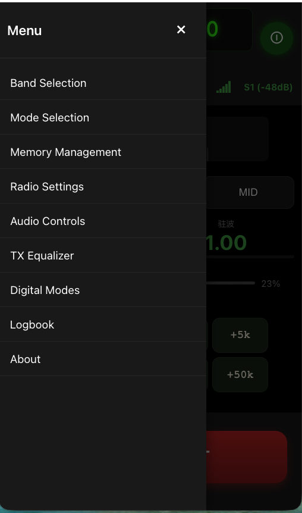
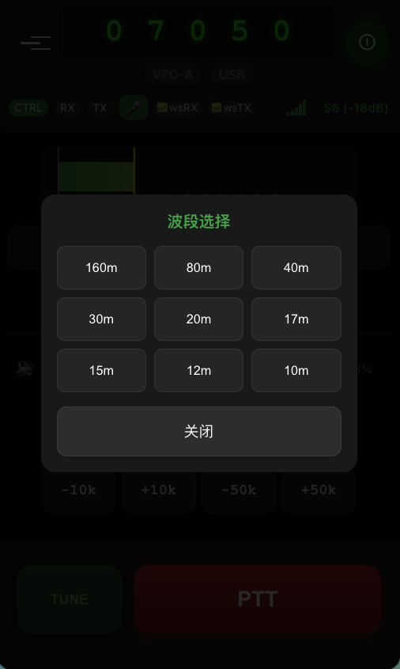
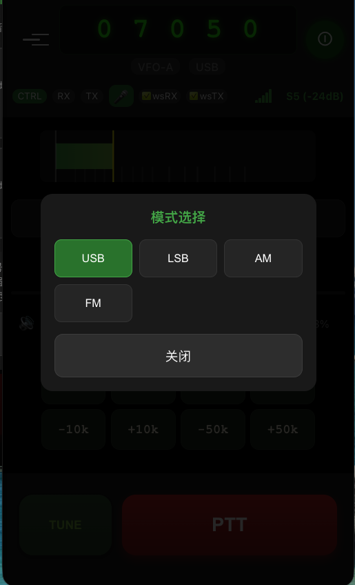
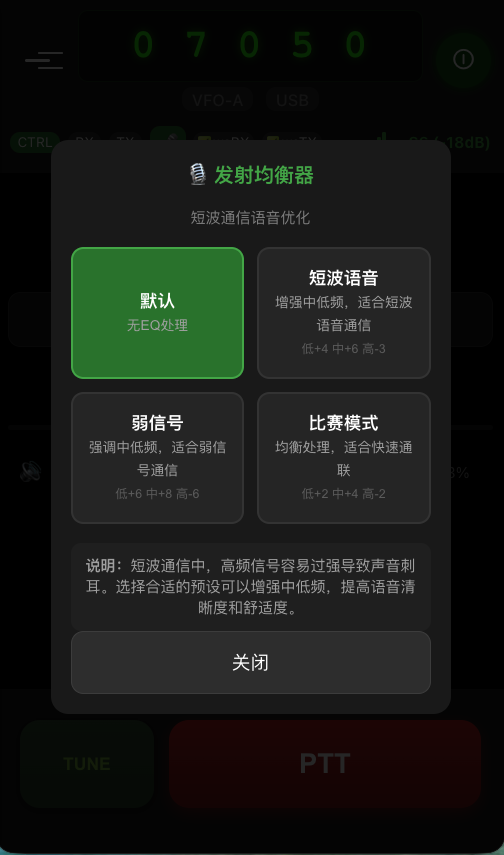
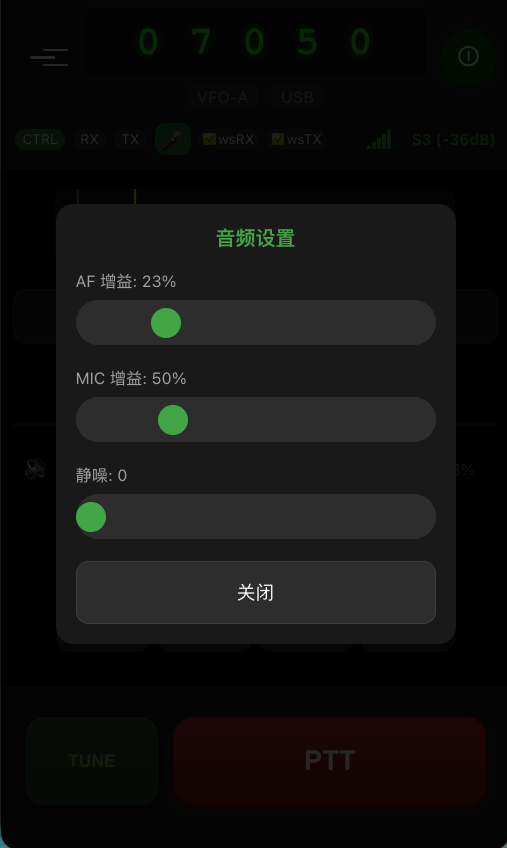

# MRRC Mobile User Manual

**Mobile Remote Radio Control - Mobile Operation Guide**

Version: V4.9.3  
Last Updated: March 10, 2026

---

## Table of Contents

1. [Quick Start](#1-quick-start)
2. [Interface Overview](#2-interface-overview)
3. [Core Features](#3-core-features)
4. [Advanced Features](#4-advanced-features)
5. [Settings and Configuration](#5-settings-and-configuration)
6. [FAQ](#6-faq)

---

## 1. Quick Start

### 1.1 Accessing the System

Access via mobile browser:
```
https://<your-server-address>/mobile_modern.html
```

> **Recommended Browsers**: Safari (iOS), Chrome (Android)

### 1.2 Login Authentication

First-time access will require username and password. Please contact your system administrator for login credentials.

### 1.3 Granting Permissions

The system requires the following permissions:
- **Microphone**: For transmit audio
- **Notifications** (optional): For status alerts

---

## 2. Interface Overview

### 2.1 Main Interface


**Interface Elements:**

| Area | Function |
|------|----------|
| Top Status Bar | Power switch, connection status, settings access |
| Frequency Display | Large font displaying current operating frequency |
| S-meter | Real-time signal strength indicator (S0-S9+60dB) |
| Power/SWR | ATR-1000 real-time power and standing wave ratio |
| PTT Button | Press and hold to transmit, release to receive |

### 2.2 Menu System



Access via menu:

| Menu Item | Function |
|-----------|----------|
| Band Selection | Band selection |
| Mode Selection | Mode selection |
| Audio Controls | Audio settings |
| TX Equalizer | Transmit equalizer |
| About | About information |

---

## 3. Core Features

### 3.1 Power On/Off

**Turning On:**
1. Click the power button in the top-left corner
2. Wait for connection to establish (button turns green)
3. Frequency display will update to the radio's current frequency

**Turning Off:**
1. Click the power button again
2. Connection disconnected (button turns red)

### 3.2 Frequency Adjustment

**Method 1: Button Adjustment**
- Click `+` button to increase frequency
- Click `-` button to decrease frequency
- Selectable steps: +5kHz / +50kHz

**Method 2: Band Selection**



Via Menu → Band Selection to quickly switch common amateur bands:
- 160m (1.8-2.0 MHz)
- 80m (3.5-4.0 MHz)
- 40m (7.0-7.3 MHz) ⭐ Recommended
- 20m (14.0-14.35 MHz)
- 15m (21.0-21.45 MHz)
- 10m (28.0-29.7 MHz)

### 3.3 Mode Switching



Via Menu → Mode Selection to switch operating modes:

| Mode | Description | Use Case |
|------|-------------|----------|
| **USB** | Upper Sideband | 20m and above bands |
| **LSB** | Lower Sideband | 40m and below bands |
| **AM** | Amplitude Modulation | AM broadcast reception |
| **FM** | Frequency Modulation | VHF/UHF FM communication |

> **Tip**: The currently selected mode is highlighted in green.

### 3.4 Transmit (PTT)

**Transmit Operation:**
1. Ensure power is on (green status)
2. Press and hold the PTT button at the bottom
3. Speak into the microphone
4. Release PTT button to end transmit

> **Note**: The PTT button triggers vibration feedback when pressed, indicating transmit has started.

**TUNE Antenna Tuner Mode:**
1. Long-press the TUNE button
2. System will transmit 1kHz tone
3. Antenna tuner automatically matches antenna
4. Release button to stop transmit

---

## 4. Advanced Features

### 4.1 Power and SWR Monitoring

When connected to ATR-1000 device, the main interface displays in real-time:

| Parameter | Range | Description |
|-----------|-------|-------------|
| Power | 0-200W | Forward power |
| SWR | 1.0-9.99 | Standing wave ratio |

> **Tip**: Power display updates only during transmit, with latency <200ms. Ideal SWR value is 1.0.

### 4.2 TX Equalizer



Optimize transmit audio quality, located at Menu → TX Equalizer.

**Preset Modes:**

| Mode | Parameters (Low/Mid/High) | Use Case |
|------|---------------------------|----------|
| Default | 0 / 0 / 0 dB | No processing |
| HF Voice | +4 / +6 / -3 dB | Regular shortwave communication |
| DX Weak | +6 / +8 / -6 dB | DX weak signal communication |
| Contest | +2 / +4 / -2 dB | Quick QSOs |

> **Note**: High frequencies in shortwave communication tend to be too strong, causing harsh sound. Selecting the appropriate preset can enhance mid-low frequencies and improve voice clarity.

### 4.3 Audio Settings



Via Menu → Audio Controls to adjust:

| Parameter | Range | Description |
|-----------|-------|-------------|
| AF Gain | 0-100% | Receive volume |
| MIC Gain | 0-100% | Transmit volume |
| Squelch | 0+ | Squelch threshold |

**Adjustment Suggestions:**
- AF Gain: Adjust according to headphone/speaker, avoid distortion
- MIC Gain: Start at 50%, adjust based on feedback from other stations
- Squelch: Set to 0 for weak signals, can increase appropriately for strong signals

### 4.4 PWA Offline Use

**Adding to Home Screen:**

**iOS Safari:**
1. Tap the share button
2. Select "Add to Home Screen"
3. Name and confirm

**Android Chrome:**
1. Tap the menu button
2. Select "Add to Home Screen"
3. Confirm addition

> After adding, you can access the basic interface offline, but real-time features require network connection.

---

## 5. Settings and Configuration

### 5.1 Connection Status Indicators

| Indicator | Status | Description |
|-----------|--------|-------------|
| Power Button | 🟢 Green | System connected |
| Power Button | 🔴 Red | System not connected |
| PTT Button | 🟢 Green | Transmitting |
| PTT Button | ⚪ White | Standby |
| S-meter | Dynamic bar | Signal strength (S0-S9+60dB) |

### 5.2 WDSP Digital Processing Settings

From Menu → Settings → 🎛️ WDSP Digital Processing

| Setting | Description | Recommended Value |
|---------|-------------|-------------------|
| WDSP Processing | Main switch | On |
| NR2 Noise Reduction | Spectral noise reduction level (0-4) | 2-3 |
| NB Blanking | Pulse noise suppression | Based on environment |
| ANF Notch | Auto CW interference removal | Enable when CW interference present |
| AGC Mode | Automatic gain control | SLOW or MED |

**WDSP Effect**: NR2 spectral noise reduction can make SSB voice sound like FM, significantly reducing background noise.

### 5.3 Performance Metrics

| Metric | Value |
|--------|-------|
| TX Latency | ~65ms |
| RX Latency | ~51ms |
| TX→RX Switching | <100ms |
| PTT Reliability | 99%+ |
| Power Display Latency | <200ms |
| WDSP Noise Reduction | 15-20dB |

---

## 6. FAQ

### Q1: PTT button not responding?

**Solutions:**
1. Ensure power is on (green status)
2. Check if microphone permission is granted
3. Refresh page to reconnect
4. Check browser console for errors

### Q2: Frequency display incorrect?

**Solutions:**
1. Refresh page to re-fetch frequency
2. Check if backend rigctld is running
3. Confirm radio is powered on

### Q3: Power/SWR not displaying?

**Solutions:**
1. Check if ATR-1000 proxy is running
2. Check if ATR-1000 device is online
3. Check backend logs for connection status

### Q4: Audio has noise or stuttering?

**Solutions:**
1. Check network connection quality
2. Try adjusting AF/MIC gain
3. Close other bandwidth-consuming applications

### Q5: How to check connection status?

**Solutions:**
1. Check power button color
   - Green: Connected
   - Red: Not connected
2. Open browser console for detailed logs

---

## Appendix

### A. Quick Operations

| Operation | Method |
|-----------|--------|
| Quick On/Off | Click power button |
| Quick Transmit | Press and hold PTT |
| Tuner | Long press TUNE |
| Mute | Slide volume to 0 |

### B. System Requirements

| Item | Requirement |
|------|--------------|
| Operating System | iOS 16+ / Android 10+ |
| Browser | Safari / Chrome latest version |
| Network | Stable internet connection |
| Permissions | Microphone |

### C. Technical Support

For issues, please contact your system administrator or refer to:
- [System Architecture Documentation](System_Architecture_Design.md)
- [FAQ](../README_CN.md#常见问题)

---

**MRRC - Mobile Remote Radio Control**  
*Amateur Radio, Anytime, Anywhere.*
