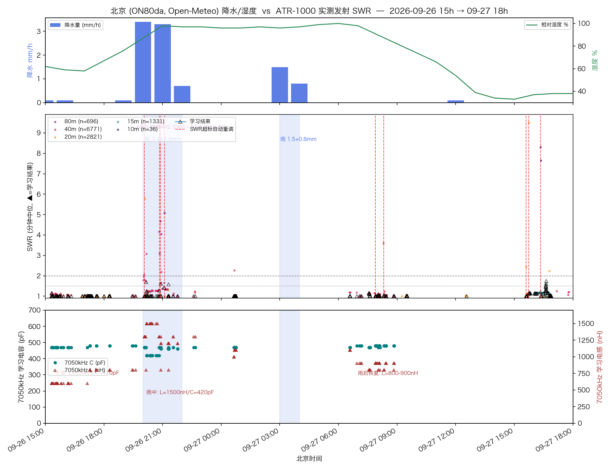

# EFHW 天线实战数据交叉分析：PSK Reporter 裸 Spot × 北京降雨 × ATR-1000 SWR

- **日期**：2026-09-27 · 台站：radio1（IC-M710 + ATR-1000，北京 ON80da）
- **配套报告**：`efhw-49-1-antenna-analysis-2026-09-27.md`（阻抗反演与 SWR 曲线，姊妹篇）
- **数据源**：
  - StarRocks `pskreporter.all_records` 原始 spot（看板 <http://radio.vlsc.net:5000/antenna> 的底层裸数据，7 天 165 条，全部 FT8）
  - `atr1000_radio1.log`（2026-09-26 15:18 → 09-27 17:47，11974 条功率/SWR 读数，已按调谐事件打频率标签）
  - `../mrrc_modern/logs/ft710-server.log` + `server.log`（同一台 ATR-1000 的 mrrc_modern/FT-710 侧记录，827 条学习事件，09-06 → 09-27）与 `../mrrc_modern/atr1000_tuner.json`
  - Open-Meteo 北京（40.2N, 116.5E）逐小时降水/湿度
- **天线实况（用户确认）**：馈电点在 4 楼窗台（约 10–12 m 高），导线向南偏西 40°（方位 ≈220°）斜下，末端挂在 3 m 多高的树腰（sloper 形态），振子 ~21 m（未实测）；UNUN = Fair-Rite 2643251002（43 材料）绕 2:14 匝（49:1），初级磁化电感 L_m ≈ 2² × 1075 nH ≈ **4.3 µH**

## 1. 看板 7 天裸 Spot 深度分析

### 1.1 总量与分波段

| 方向 | 波段 | n | 平均 SNR | 中位 | 最佳 | 最差 |
|---|---|---|---|---|---|---|
| TX（BG1SB 被收） | 40m | 13 | **-3.5 dB** | -5 | **+23** | -16 |
| TX | 20m | 6 | -12.0 | -13.5 | 0 | -17 |
| TX | 15m | 6 | **-3.2** | -5 | +10 | -14 |
| RX（BG1SB 收听） | 40m | 130 | -11.1 | -13 | +8 | -21 |
| RX | 20m | 10 | -14.4 | -15.5 | -3 | -21 |

TX 样本少（25 条）是因为 BG1SB 以接收值班为主、发射次数少；RX 140 条全部集中在夜间。**TX 40m/15m 平均 -3.5/-3.2 dB 明显强于 RX 的 -11.1 dB**——发射出去的信号被收得比别人发来的好 6–8 dB，这是"发射效率尚可 + 接收端本地噪声偏高"的典型组合（城区环境）。

### 1.2 距离分层（跳越分析）

| 层 | TX n (占比) | TX 均 SNR | RX n (占比) | RX 均 SNR |
|---|---|---|---|---|
| 500–2000 km 单跳 | 8 (32%) | **-0.4 dB** | 51 (36%) | -7.6 dB |
| 2000–4000 km 远单跳 | 12 (48%) | -6.0 | 36 (26%) | -9.6 |
| 4000–8000 km 双跳 | — | — | 45 (32%) | -16.0 |
| >8000 km 多跳 | 5 (20%) | -12.2 | 7 (5%) | -15.1 |

看板 `hop_analysis` 同源结果一致。读法：40m 夜间单跳（500–2000 km，日韩/东北/华东圈）是本天线的**主力工作区**，TX 平均 -0.4 dB 说明对临近区的辐射效率完全正常；双跳以外迅速衰减符合低架 sloper 的仰角特征（看板 `elevation`：仰角集中 9–12°，属中低仰角——比典型低架偶极好，得益于 4 楼馈点高度）。

### 1.3 方位分布 × Sloper 物理朝向（核心交叉）

| 方位象限 | TX n / 均 SNR | RX n / 均 SNR |
|---|---|---|
| 45–90°（东北） | 5 / -5.4 | 13 / -9.5 |
| **90–135°（东~东南）** | **12 / -1.2** | **40 / -8.3** |
| 135–180°（南） | 4 / -12.0 | 21 / -9.5 |
| 180–225°（西南） | 2 / -13.5 | 4 / -11.0 |
| **225–270°（西南偏西）** | 1 / -5.0 | 7 / **-4.9（全场最强均值）** |
| 270–315°（西北） | — | 29 / -14.4 |
| 315–360°（北） | 1 / -14.0 | 26 / **-16.5（最弱）** |

交叉解读：

- **数量峰值在东/东南（90–135°）**，但那是台站密度偏差（JA、VK/ZL、北美西海岸都在该方向），不代表天线增益方向。
- **归一化到强度均值后，最强象限是 225–270°（西南偏西）——正是 sloper 下坡端方向（≈220°）**。样本少（n=7+1）但均值 -4.9 dB 显著优于全场。与 sloper 理论一致：低端导线下指方向获得 1–3 dB 前后比（website/efhw 研究站的 sloper 章节）。
- **西北~北（270–360°，欧洲方向）数量多（55 条）但全场最弱（-14~-16 dB）**——天线背向 + 高纬长路径双重吃亏。想打欧洲，现状不理想。
- 看板 `noise_floor` 报 14 个方位疑似噪声源（60–320° 散布），最静方向 -21 dB；与阻抗分析"共模路径显著"的结论互为印证——**馈点 CMC 状态值得检查**。

### 1.4 时间规律与 DX 亮点

- RX 40m 全部集中在 **00–06 时（北京夜间）**，02–04 时最强（-9~-10 dB）——典型 40m 夜间传播；白天 40m 完全没有 spot，说明白天 D 层吸收下这副低架 sloper 在 40m 基本收不到天波。
- TX DX 高光：**9/26 21:09（大雨中！）40m 被 ZL1RPC/F（新西兰，10412 km，方位 137°）以 -4 dB 抄收**；同晚 VK2ESE 8941 km。雨中失谐（§2）并没有挡住 DX——天调及时重学（20:04 自动触发）把匹配拉了回来。
- RX DX：CT7AXN 葡萄牙 9592 km（9/27 05:39，-17 dB）、EA7BD 西班牙 9500 km——欧洲 LP/SP 凌晨窗口能收到，但都在 -16 dB 以下的边缘。

## 2. 降雨 vs SWR：雨致失谐的完整实测记录（独家数据）

### 2.1 26 小时分波段实测 SWR（发射态，功率≥3W）

| 波段 | n | 中位 SWR | p90 | 结论 |
|---|---|---|---|---|
| 40m | 6771 | 1.11 | 1.34 | 健康（天调工作） |
| 20m | 2821 | 1.03 | 1.10 | 极佳 |
| 15m | 1331 | 1.17 | 1.17 | 极佳（接近免调谐） |
| **80m** | 696 | **13.36** | 39.2 | **结构性不可用，再次实锤** |
| 10m | 36 | 7.24 | 20.2 | 边缘（9/27 下午两次触发自动重调后学到 LC 0.2µH/110pF） |

### 2.2 7050 kHz 学习参数随降雨的漂移（雨致失谐的直接证据）

| 时段 | 天气 | 学习参数 | 解读 |
|---|---|---|---|
| 9/26 15:19–17:08 | 干燥（RH 55–65%） | LC **L=0.6 µH** / C=470 pF | 基线 |
| 9/26 17:16–19:37 | 雨前（RH 爬升） | L=0.8 / C=480 | 轻微漂移 |
| 9/26 20:00 | **降雨开始（3.4 mm/h）** | — | **20:04 SWR 超标，自动触发完整调谐** |
| 9/26 20:10–20:12 | 大雨中 | LC **L=1.5 µH** / C=420 pF | 串联电感需求 ×2.5 |
| 9/26 20:55–22:40 | 雨渐停（RH 94–98%） | L=1.2–1.3 / C=460–470 | 部分回摆 |
| 9/27 00:39–00:46 | 雨后深夜 | L=1.0–1.1 / C=470 | 继续回摆 |
| 9/27 06:56–08:51 | 次日早晨 | L=0.8–0.9 / C=470–480 | 接近但未完全回到基线 |

**定量解读**：7.05 MHz 上串联 L 需求从 0.6 → 1.5 µH，即天线侧电抗向容性方向移动了 ΔX ≈ ω·ΔL ≈ 2π×7.05e6×0.9e-6 ≈ **+40 Ω（更容性）**。这正是 EFHW 雨致失谐的教科书机制：雨水（尤其是搭在 3 m 树腰上的远端）增加导线对地分布电容、并引入介质损耗 → 导线电长度变长 → 谐振点下移（估算下移 ~40–60 kHz）→ 固定频点上天线更偏容性 → 需要更多串联电感补偿。末端挂在树上这一点放大了该效应——湿树皮是半导体，相当于给导线末端并了一个随天气变化的 R-C。

### 2.3 mrrc_modern 侧日志补完：漂移更早、更剧烈，还有插曲

mrrc_modern（FT-710 前端）的 `logs/ft710-server.log` 覆盖同一台 ATR-1000，把雨窗内的过程补得更完整（学习事件各计 2 次为双写，已去重理解）：

- **20:01:32（雨开始后仅 1 分钟）7050kHz 实测 SWR 已漂到 1.77/1.69**——比 20:04 的自动重调触发更早，是雨致失谐的最早时间戳。
- **20:50–21:06 大雨峰值期出现失谐雪崩**：7050kHz 实测 SWR 2.98 → 4.36 → 6.99 → **13.68** → 12.58，连续 3 次 full tune 两次失败（最好 5.13），直到 21:06 才调回 1.64。雨中天线阻抗在持续移动，调谐在追一个移动靶。
- 20:13–20:15 出现 **CL L=0.7µH/C=240pF 的交替解**（与 LC 15/42 并存）——失谐量大时 L 网络两个拓扑都能闭合，学习库会在两解之间抖动，属正常现象。
- 9/24–9/25（另一次降雨前后）的"干燥基线"是 L=0.7/C=420–440pF，与 9/26 的 L=0.6/C=470 不完全相同——除降雨外还存在逐日的环境漂移（湿度/温度/树况），量级约 ±0.1µH/±40pF。

### 2.4 重要排雷：mrrc_modern 3850kHz 记录是假学习（含一个真实 bug）

mrrc_modern 学习库里有一条 **3850kHz LC L=0.2µH/C=120pF、n=482、SWR=1.30** 的记录，看似"80m 其实能调好"。还原 `ft710-server.log` 时间线后证伪：

1. 09-26 06:37:08 切到 3850kHz，调用旧参数 LC L=3.2µH/C=1180pF；06:37:19 实测 SWR 2.86 → 触发 full tune（mode=2）；
2. 06:37:23.859 CQ 播放完毕、**TX 结束**；06:37:23.958 tuning cleared（TX end）；
3. 06:37:24.967 —— TX 停止约 1 秒后，学习门限采到 SWR=1.00（无载波时的反射读数），**把 SWR 2.86→1.00 记成"auto_success"并写入学习库**；
4. 06:38:22 同一组 L=2/C=12 复测，真实 SWR = **13.42**；两次 full tune 最好只到 3.86 / 4.02。

结论：80m 不可用的判断不变且被实测加固（9/25 21:09 一次 full tune 甚至调到 99.90）；该假记录已从模型锚点中排除。**同时这是 mrrc_modern `atr1000_client.py` 的一个真实缺陷：学习采样没有排除"TX 刚结束"的窗口**（learn gate 只看功率≥3W + SWR 1.0–1.8，PTT 松开瞬间的缓存功率读数可能仍 ≥3W）。建议在 learn gate 加"采样时刻必须处于 TX keyed 状态且距 TX 开始 ≥1s"的硬条件。

### 2.5 双软件并发的记账串扰

9/26 20:50–20:53 radio1（IC-M710）在 **3850kHz** 调谐失败的同一秒，mrrc_modern 侧把事件记在自己当前的 **7050kHz** 上，并在 20:51:33 把 LC **L=4.5µH/C=1180pF**（典型 80m 量级参数）学进了 7050kHz 键位——学习库一度被串台污染（后被后续正确学习覆盖）。两套软件同时连接同一台 ATR-1000 时，各自的频率上下文不同步，继电器状态与学习记录会互相打架。**运维建议：同一时刻只让一个实例承担 ATR-1000 的调谐/学习管理。**

**SWR 表现分段**（40m 发射态）：雨前中位 1.06 → **雨中 1.27（p90 1.89）** → 雨后夜间 1.06 → 次日午后 1.20。26 小时内 9 次"SWR 超标自动重调"中，2 次直接由降雨触发（20:04 @7050 kHz，正是雨开始后 4 分钟；80m 的 2 次属结构性失败）。

**对 RX 的影响**：降水窗口 RX SNR 均值 -10.0 dB vs 干燥窗口 -11.7 dB——看似雨中反而更好，但降水窗口全部落在夜间强传播时段（20–22h、03–04h），被时段混淆，**不下因果结论**。

## 3. 汇总裁决与建议

1. **天线本体状态健康**：40/20/15m 天调后 SWR 中位 ≤1.17；15m 近免调谐；单跳区 TX 效率正常（-0.4 dB）；雨中能打穿 10400 km 到新西兰——系统没有硬伤。
2. **雨致失谐规律已量化**：40m 谐振在雨中下移 ~40–60 kHz（7050 kHz 处需 +0.9 µH 串联补偿），恢复时间常数约 4–10 小时（RH 从 98% 回落过程）。建议：大雨后第一个 QSO 前手动触发一次完整调谐（或接受前 30 秒 SWR 1.3–1.9 的自动重学过程）。
3. **80m 彻底放弃**：学习中位 SWR 13.4 + 阻抗结构性外推（可达 SWR 2.8–5.0，C 顶满 1270 pF 撞墙）+ 馈线损耗 3–6 dB + **mrrc_modern 实测 full tune 最好仅 3.86（9/26 06:38）、一次调到 99.90（9/25 21:09）**——四重实锤，详见姊妹篇 §5 与本篇 §2.4。
4. **方向性**：sloper 下坡方向（西南 ≈220°）均值最强，与理论一致；欧洲方向（西北）是短板。若在意欧洲，可考虑把低端换个挂点方向，或接受现状（东亚/大洋洲才是主力区）。
5. **10m 边缘化**：9/27 下午两次自动重调（15:36/16:20 @28074 kHz）提示 10m 匹配在量化网络边缘（锚点 LC 0.2/110 的 n=5 仍偏弱）——建议挑干燥时段对 28.074 做一次完整调谐加样本。
6. **软件侧两个待修项**：① mrrc_modern `atr1000_client.py` 学习门限需排除 TX 结束后的窗口（§2.4 的 3850 假学习就是这么来的，n=482 污染颇深）；② 双软件并发控制同一台 ATR-1000 会互相污染学习库（§2.5），建议约定单一管理实例或加互斥。
7. **待办验证**：馈点 CMC 检查（噪声方位 14 个 + 拟合共模自由度缺失）；NanoVNA 馈点端扫频校准参考模型（L_m=4.3 µH 已按用户提供的 2643251002 参数固定；合并双库 38 锚点后重拟合 f1=6.90 MHz、Z0w≈500 Ω、αl≈0.18、C_s2≈5.8 pF，馈线长度顶到搜索边界未约束——需实测补足）。

## 附录：数据与脚本

- 裸 spot：`/tmp/ant7/bg1sb_spots_7d.json`（原始 165 条）、`bg1sb_spots_7d_enriched.json`（含距离/方位/波段标签）；分析脚本 `/tmp/ant7/analyze_spots.py`
- SWR 序列：`/tmp/ant7/swr_series.json`（11974 条）、`swr_tagged.json`（打频率标签）；交叉绘图脚本 `/tmp/ant7/swr_rain_cross.py`
- mrrc_modern 侧：`/tmp/ant7/modern_learn.json`（827 条学习事件，09-06 → 09-27，提取自 `../mrrc_modern/logs/ft710-server.log` 与 `server.log`）；学习库 `../mrrc_modern/atr1000_tuner.json`（34 条）
- 天气：Open-Meteo 逐小时（Asia/Shanghai），窗口内降水：9/24 21h 5.9 mm、**9/26 20–22h 3.4+3.3+0.7 mm**、9/27 03–04h 1.5+0.8 mm
- 时区说明：spot 与 ATR 日志均为北京本地时间（UTC+8）；StarRocks 服务器 NOW() 为 UTC，跨表关联需 +8h
