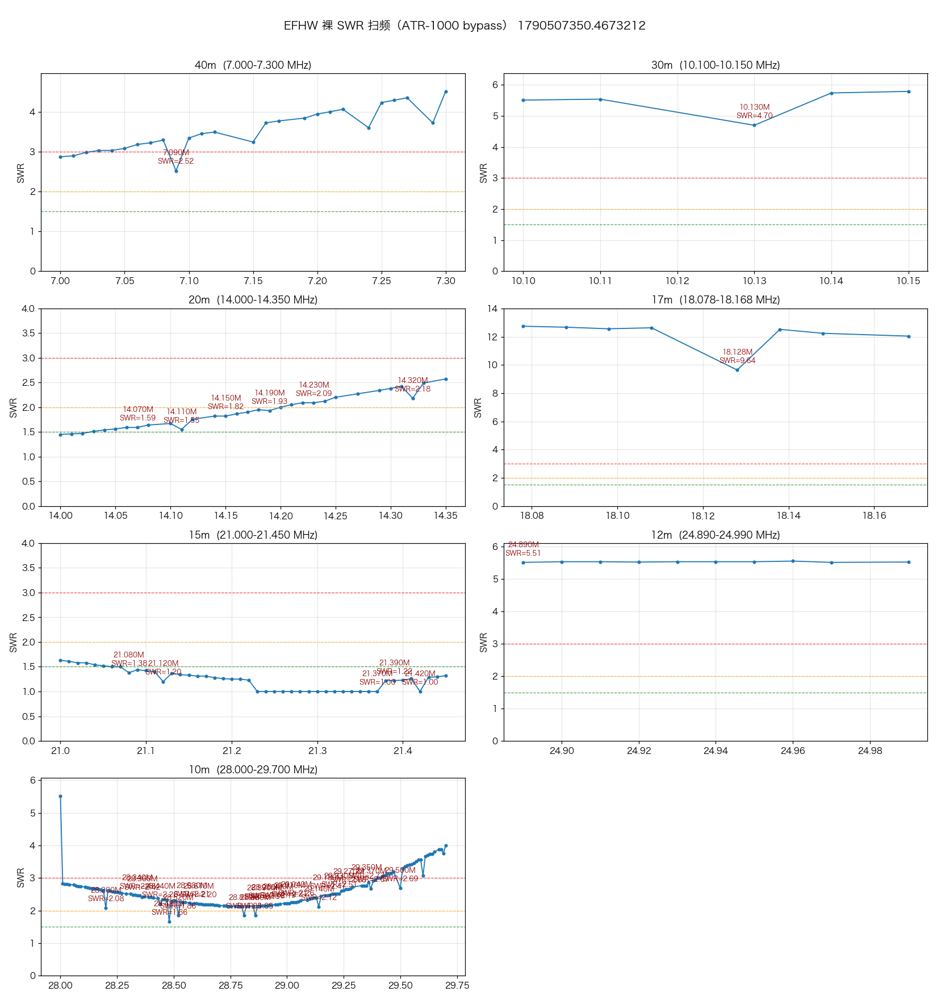
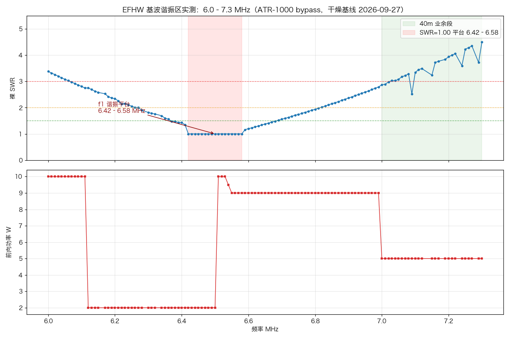

# EFHW 天线裸 SWR 全段扫频基线（2026-09-27 傍晚，干燥无雨）

> 配套报告：`efhw-49-1-antenna-analysis-2026-09-27.md`（LC 反演与参数测算）、
> `efhw-spots-rain-cross-analysis-2026-09-27.md`（spot×降雨×SWR 交叉）。
> 本文是**实测基线**：ATR-1000 完全 bypass（L=0/C=0）下的 7–29.7MHz 裸 SWR 扫描。

## 1. 测量方法（本次新增的基础设施）

- 扫描引擎 `antenna_sweep.py` + API `/api/antenna_sweep/*` + 前端 `www/antenna_sweep.html`
  （桌面 index.html 📡 按钮 / 移动端菜单"📡 天线扫频"），结果存 `antenna_sweeps/sweep_*.json`。
- 代理新增两个开关：**`set_learning`**（防学习库污染）和 **`set_autotune`**（防 SWR>2
  自动完整调谐破坏 bypass 测量，`atr1000_proxy.py` `AUTOTUNE_ENABLED`）。
  本次扫描 312 点全程自动调谐触发 **0 次**，学习库 diff 为空（34→34 条）。
- 扫描期间暂停了 mrrc_modern（FT-710 侧）——它有独立的 SWR 自动重调守卫和
  ≥3W 学习门，直连同一台 ATR-1000，扫频时必须错开。
- 键控参数：tune 音常开，逐点 PTT 0.4s 稳定 + dwell 1.2s 采样取中位，10kHz 步进。
- 前向功率 40m 约 5W，15m 约 4–5W，10m 仅 1–2W（ tune 音 5% 音量 + 高频段
  音频链/ALC 衰减）。

## 2. 数据质量说明

SWR=1.00 的**孤立尖点/短游程**是电表反射通道掉读，不是真谐振——真天线
SWR 曲线在 10kHz 尺度上必然平滑过渡。剔除规则（固化在
`dev_tools/analyze_sweep.py` 的 `split_dropouts`，今后扫描自动生效）：
连续 ≤3 点的 1.00 游程、且两侧最近非 1.00 邻点都 >1.35 → 判掉读。
本次共剔除 **36 点**（10m 21 / 40m 5 / 20m 5 / 17m 3 / 30m 1 / 12m 1），
移入结果文件的 `dropped_points` 字段，原始备份
`sweep_20260927_190910.json.bak_raw`。
**全部 36 点当天已用 `freqs_khz` 自定义频点方式长驻留（2.5s）复测验证**
（`sweep_20260927_194941.json`）：复测值全部 >1.35 且与周围平滑曲线完全吻合
（如 7130: 1.00→3.58，14090: 1.00→1.67，18068: 1.00→12.74），
36/36 确认为掉读，无一点冤枉；复测值已回写 `dropped_points[].remeasured_swr`。
15m 的 1.00 平台宽 16 点、边缘渐变（邻点 1.2–1.4），是真谐振平台，全部保留。
10m 段功率只有 1–2W，是掉读重灾区，趋势可信、绝对值偏乐观。

**复测事故教训**：第一次复测被同在运行的 mrrc_modern（FT-710 侧）的
SWR 自动调谐守卫污染——它在 7140 测到一半时触发完整调谐，后续点全部带着
L/C 测出 1.08-1.58 的假低 SWR。**任何 bypass 测量前必须确认 mrrc_modern
已停**（铁律已写入 `.pi/skills/antenna-sweep/SKILL.md`）。

## 3. 裸 SWR 结果（bypass，掉读点已剔除）

| 波段 | 范围 | 裸 SWR 中位 | 最低点 | 形态 | 结论 |
|---|---|---|---|---|---|
| 40m | 7.00–7.30 | **3.47** | 2.52 @7.09 | 2.9→4.5 总体上升 | 全段需天调（0/26 点 ≤1.5） |
| 30m | 10.10–10.15 | **5.54** | 4.70 @10.13 | 平 | 差，无锚点，未填充 |
| 20m | 14.00–14.35 | **1.90** | 1.45 @14.00 | 1.45→2.5 上升 | 好，下半段接近直通可用 |
| 17m | 18.07–18.17 | **12.54** | 9.64 @18.13 | 全程 ≥9.6 | **最差**，反谐振区 |
| 15m | 21.00–21.45 | **1.25** | 1.00 平台 @21.23–21.42 | 1.6→1.0 缓降进平台 | **最佳**，46/46 点 ≤2.0 |
| 12m | 24.89–24.99 | **5.53** | 5.51 | 平 | 差，锚点样本不足未填充 |
| 10m | 28.00–29.70 | **2.48** | 1.66 @28.48 | 2.8→2.5 谷→3.5–4 升 | 中等，中段可用 |
| 80m | 3.80–3.90 | **16.2** | 16.09 @3.90 | 完全平坦（16.1–16.3） | **彻底不可用** |

## 4. 谐振结构实测定论（6.0–7.3MHz 加密扫描，`sweep_20260927_200404/200731.json`）

**基波 f1 = 6.50 MHz**：SWR=1.00 平台宽 6.42–6.58MHz（17 点），两翼平滑上升
（左：6.0M=3.38 → 6.41=1.35；右：6.59=1.16 → 7.0=2.87 → 7.3=4.5），
是教科书式的谐振 V 曲线。此前 LC 反演估的 6.88–6.94 **偏差约 6%，以实测为准**。

物理长度推算：f1=6.50MHz，自由空间 λ/2=23.1m，取速度系数 0.93–0.95
→ **振子实长 ≈ 21.5–21.9m**，与"21m 左右"的估计吻合（略微偏长一点点，
正好把 f1 压到 40m 段下沿之外）。

各谐振点（实测）：f1=6.50（本测）、2f≈13.9–14.0（20m 段底 1.45 且向下走）、
3f≈21.3（15m 平台）、4f≈28.5（10m 洼）。谐波比 1 : 2.15 : 3.28 : 4.38——
高次谐波逐级上漂是 EFHW 末端效应随频率减弱的典型表现。

**对 40m 的含义**：整个 40m 段都在 f1 右侧上升翼上（7.0M 裸 SWR 已 2.87），
天调必不可少；段内频率越高失配越重，与拟合参数 ind 随频率增大的趋势一致。

## 4.5 80m 段实测（同日补测，`sweep_20260927_195943.json`，11 点 × 10kHz）

3800–3900kHz 裸 SWR 全程 **16.1–16.3 平坦如镜**（5W、每点 11–17 样本、零掉读）。
平坦说明整段内天线阻抗没有任何谐振迹象：3.85MHz ≈ 0.55×f1，振子仅约 0.28λ，
呈极低辐射电阻 + 高容抗的极端失配。这解释了为什么 full tune 最好也只能到 3.86
且 C 撞 1270pF 上限（见 LC 反演报告）——**80m 对这条 49:1 EFHW 是结构性死段，
不是调谐参数问题**。学来的 3850 记录（n=476 那条）历史上就不可能稳定工作。

## 5. 天调参数拟合填充（dev_tools/fit_tuner_params.py）

以实测学习锚点（样本数加权 + 离群剔除）做波段内线性拟合，向学习库空位
（10kHz 栅格、±5kHz 内无实测记录）写入 **270 条拟合记录**：

- 40m +26、20m +28、17m +9、15m +39、10m +168
- 30m/12m 无可信锚点跳过；80m 结构性不可调（见 LC 反演报告）不参与
- 拟合记录带 `source:"fit"`、`sample_count:0`、`needs_verify:true`；
  真实学习会自然覆盖，拟合偏差大时 SWR 守卫触发完整调谐后自学习纠正（自愈合）
- 备份：`atr1000_tuner.json.bak_fit_20260927_192844`
- 40m 段外推幅度大（锚点集中在 7045–7074，斜率 ind +0.11/kHz 推到全段
  L=3→36），段沿参数不确定性高，靠守卫自愈

## 6. 使用建议（干燥基线口径）

1. **15m 基本不用调**（裸 SWR ≤1.63 全段），21.3–21.4 直通最佳
2. 20m 下半段（14.0–14.15）接近直通，上半段用拟合 CL 参数（ind 3–6, cap 10–17）
3. 40m 必须天调；7050 附近参数最可靠（n=1075 锚点）
4. 17m/30m/12m 是这条天线的结构性弱段，17m 裸 SWR>12 即使天调也费力，
   实际通联优先避开
5. 雨天 7050 需 L 0.6→1.5µH 的失谐量（见交叉报告）——雨后可重跑扫频对比
   基线漂移，扫频页选"40m"单段 2 分钟即可
