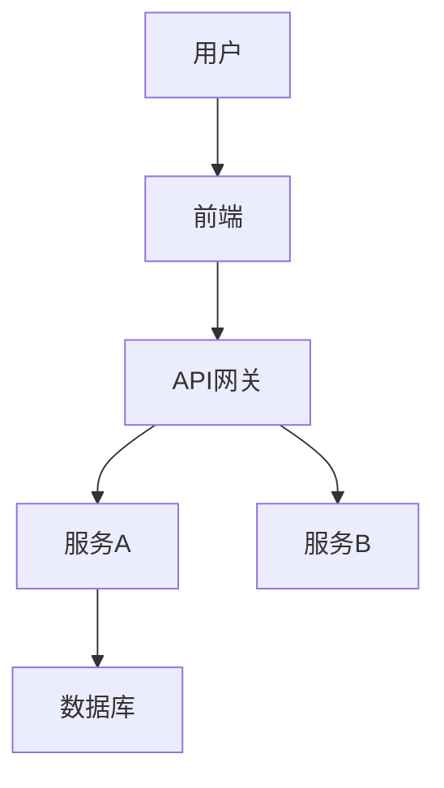

# Vibe-SDD Architect Skill

## 概述

本skill将IBM企业级架构方法论(TeamSD)与现代化AI辅助编程(vibe coding)相结合，通过SDD (Specification-Driven Development) 框架驱动团队协作高效交付。

## 核心价值

- 将传统架构设计转化为AI时代的工程实践
- 通过规格驱动确保vibe coding的质量与可维护性
- 建立人机协作的标准化工作流程
- 保留架构决策的可追溯性

## 使用场景

1. **AI辅助开发**: 使用Cursor/Windsurf/Devin等工具进行vibe coding
2. **团队协作**: 多开发者协同AI编程项目
3. **架构设计**: 将企业架构思维注入AI开发流程
4. **知识传承**: 将架构决策结构化文档化

## 核心命令

### 1. 初始化项目架构
```
/vibe-sdd init [project-name] [type]
```
- 初始化Vibe-SDD项目结构
- type: webapp/mobile/backend/fullstack
- 自动生成工作产品目录

### 2. 创建架构文档
```
/vibe-sdd create [artifact] [options]
```
- 快速创建核心架构文档
- 支持: context/requirements/architecture/decisions/estimation/viability

### 3. 生成AI提示词
```
/vibe-sdd prompt [stage] [context]
```
- 根据架构文档生成vibe coding提示词
- stage: plan/explore/develop/implement/confirm
- context: 项目上下文

### 4. 团队协作
```
/vibe-sdd sync [action]
```
- sync members: 同步团队成员
- sync artifacts: 同步架构文档
- sync decisions: 同步决策记录

### 5. 迭代演进
```
/vibe-sdd evolve [artifact] [changes]
```
- 记录架构演进
- 追踪决策变更历史

## 工作流程

### Phase 1: PLAN - 理解与规划

**AI时代实践**:
1. 用户访谈 → AI对话摘要
2. 业务分析 → AI生成业务模型
3. 机会识别 → AI辅助需求发现

**核心产出**:
- SPEC.md (项目规格)
- CONTEXT.md (系统上下文)
- PERSONAS.md (用户画像)

**Vibe Coding提示词模板**:
```
你是[角色]，请分析以下业务需求：
[业务描述]

请生成：
1. 核心业务流程
2. 关键用户故事
3. 技术约束条件
4. 初步架构建议
```

### Phase 2: EXPLORE - 探索与分析

**AI时代实践**:
1. 需求捕获 → AI辅助用例生成
2. 技术选型 → AI分析权衡
3. 可行性评估 → AI辅助风险识别

**核心产出**:
- REQUIREMENTS.md (需求矩阵)
- NFR.md (非功能需求)
- ARCH-DECISIONS.md (架构决策)
- SYSTEM-CONTEXT.md (系统上下文)

**Vibe Coding提示词模板**:
```
基于以下项目规格：
[SPEC.md内容]

请分析并生成：
1. 功能需求列表（ID-名称-描述）
2. 非功能需求（性能/安全/可用性等）
3. 技术选型建议（对比3个方案）
4. 初步系统上下文图
5. 关键架构决策点
```

### Phase 3: DEVELOP - 开发与设计

**AI时代实践**:
1. 架构设计 → AI生成架构图
2. 组件设计 → AI辅助模块划分
3. 估算 → AI辅助工作量评估

**核心产出**:
- ARCH-OVERVIEW.md (架构概览)
- COMPONENT-MODEL.md (组件模型)
- SERVICE-MODEL.md (服务模型)
- OPERATIONAL-MODEL.md (运营模型)
- ESTIMATION.md (估算报告)

**Vibe Coding提示词模板**:
```
项目上下文：
[项目概述]

技术约束：
[技术栈/标准/偏好]

请设计：
1. 架构概览（高层视图）
2. 组件划分及职责
3. 服务/接口设计
4. 部署拓扑
5. 关键数据流

使用以下格式输出Mermaid图表
```

### Phase 4: IMPLEMENT - 实施与迭代

**AI时代实践**:
1. 代码生成 → AI实时补全
2. 审查 → AI辅助代码审查
3. 测试 → AI生成测试用例

**核心产出**:
- IMPLEMENTATION.md (实施指南)
- AI-PROMPTS.md (迭代提示词库)

### Phase 5: CONFIRM - 确认与交付

**AI时代实践**:
1. 价值验证 → AI辅助指标分析
2. 经验总结 → AI辅助文档生成

**核心产出**:
- VALIDATION.md (价值确认)
- LESSONS.md (经验教训)

## 核心工作产品

### 1. SPEC.md - 项目规格
```markdown
# [项目名称] 规格说明书

## 1. 业务背景
[描述业务背景和动机]

## 2. 目标与成功标准
### 目标
- 目标1
- 目标2

### 成功标准
- 标准1
- 标准2

## 3. 范围
### 包含
- 范围1
### 不包含
- 范围1

## 4. 约束
- 约束1

## 5. 风险
- 风险1
```

### 2. CONTEXT.md - 系统上下文
```markdown
# 系统上下文

## 用户
| 角色 | 描述 | 交互 |
|------|------|------|
| 角色1 | 描述 | 交互方式 |

## 外部系统
| 系统 | 接口 | 协议 |
|------|------|------|
| 系统1 | API | REST |

## 数据流
[使用Mermaid图表]
```

### 3. REQUIREMENTS.md - 需求矩阵
```markdown
# 需求矩阵

| ID | 类型 | 名称 | 描述 | 优先级 | 状态 |
|----|------|------|------|--------|------|
| REQ-001 | 功能 | 登录 | 用户登录功能 | P0 | 新增 |

## 功能需求
### REQ-001: 用户登录
描述: ...
验收标准: ...
```

### 4. NFR.md - 非功能需求
```markdown
# 非功能需求

## 性能
| 指标 | 目标 | 条件 |
|------|------|------|
| 响应时间 | <200ms | 正常负载 |

## 可用性
| 指标 | 目标 |
|------|------|
| SLA | 99.9% |

## 安全
- 认证: JWT
- 加密: TLS 1.3

## 扩展性
- 水平扩展支持
- 微服务架构
```

### 5. ARCH-DECISIONS.md - 架构决策
```markdown
# 架构决策记录

## AD-001: [决策标题]
- 日期: YYYY-MM-DD
- 状态: 提议/已批准/已废弃
- 决策者: [名字]

### 问题
[描述要解决的问题]

### 决定
[描述最终决定]

### 理由
[解释为什么做出这个决定]

### 替代方案
1. 方案A - [理由排除]
2. 方案B - [理由排除]

### 影响
- 正面: [影响1]
- 负面: [影响1]
```

### 6. ARCH-OVERVIEW.md - 架构概览
```markdown
# 架构概览

## 高层视图


## 组件说明
| 组件 | 职责 | 技术 |
|------|------|------|
| 前端 | UI交互 | React |
```

### 7. ESTIMATION.md - 估算报告
```markdown
# 估算报告

## 项目范围
[范围描述]

## 估算方法
[使用的估算模型]

## 工作量估算
| 模块 | 人天 | 备注 |
|------|------|------|
| 总计 | XX | |

## 风险缓冲
- 技术风险: +10%
- 需求不明确: +15%
```

## AI提示词最佳实践

### 提示词结构
```
## 角色设定
你是一名[角色]，专注于[领域]

## 上下文
[项目背景信息]

## 任务
[具体任务描述]

## 约束
- 约束1
- 约束2

## 输出格式
[期望的输出格式]
```

### 迭代优化技巧
1. **分步迭代**: 先基础功能，后优化增强
2. **示例引导**: 提供参考代码/架构
3. **明确验收**: 给出具体可验证的标准
4. **约束量化**: 用数字而非形容词

## 团队协作模式

### 分层架构
```
Team Lead (架构决策)
    │
    ├─ AI Engineer (提示词优化)
    ├─ Feature Team 1 (功能模块)
    │   └─ AI Copilot
    └─ Feature Team 2 (功能模块)
        └─ AI Copilot
```

### 决策流程
```
Proposal → AI Analysis → Team Review → Decision → Documentation
```

## 与传统TeamSD映射

| TeamSD阶段 | Vibe-SDD阶段 | 关键差异 |
|------------|-------------|---------|
| PLAN | PLAN | AI辅助需求发现 |
| EXPLORE | EXPLORE | AI生成架构选项 |
| DEVELOP | CODE | AI实时代码生成 |
| IMPLEMENT | ITERATE | AI辅助测试部署 |
| CONFIRM | VALIDATE | AI辅助指标分析 |

## 配置

### 工具集成
- Cursor: 使用 .cursorrules
- Windsurf: 使用 .windsurfrules
- Devin: 使用 SPEC.md作为输入

### 环境变量
```
VIBE_SDD_PROJECT_ROOT=./project
VIBE_SDD_TEMPLATE_DIR=./templates
VIBE_SDD_AI_PROVIDER=claude
```

## 示例项目

参考 `examples/` 目录下的完整示例：
- e-commerce: 电商系统
- saas-platform: SaaS平台
- mobile-app: 移动应用

---

*本skill将企业级架构方法论转化为AI时代的工程实践，通过规格驱动确保vibe coding的高质量交付*