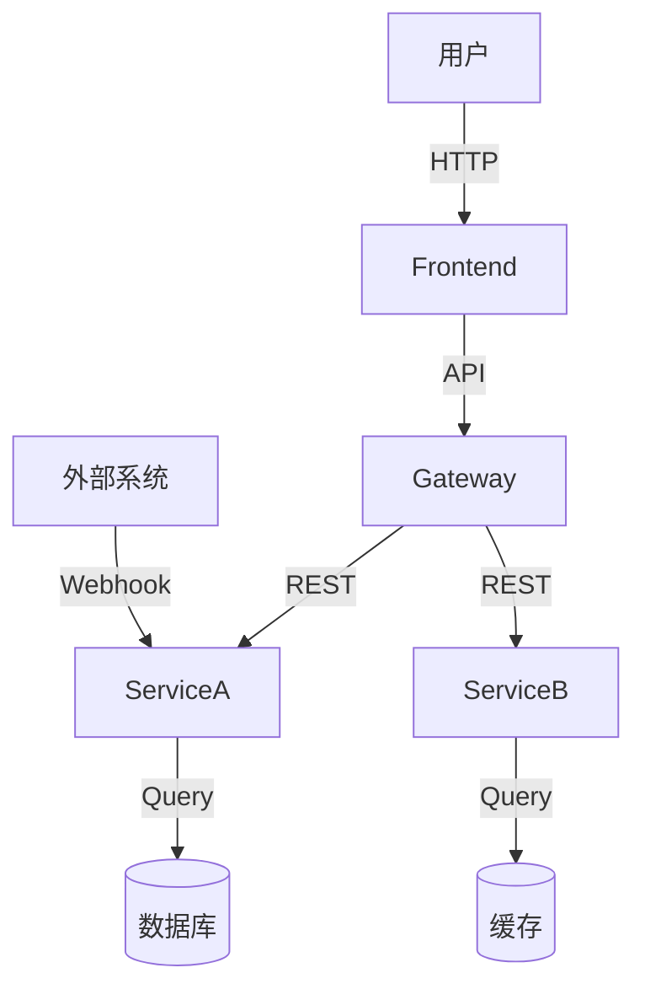

# AI提示词库

> Vibe-SDD各阶段的提示词模板集合

---

## Phase 1: PLAN - 需求发现

### 1.1 业务理解提示词

```
## 角色
你是一名资深业务分析师，擅长将业务需求转化为技术规格。

## 上下文
项目背景：[项目背景描述]

客户/用户访谈摘要：
[访谈内容]

## 任务
请分析以上信息，生成以下内容：

1. **业务模型**
   - 核心业务流程（用Mermaid流程图表示）
   - 关键业务实体
   - 业务规则

2. **用户旅程**
   - 主要用户角色
   - 每个角色的核心用户旅程

3. **初步机会点**
   - 识别3-5个关键改进机会
   - 每个机会的业务价值评估

4. **风险与约束**
   - 主要业务风险
   - 合规要求
   - 技术约束

## 输出格式
使用Markdown格式输出，包含适当的Mermaid图表。
```

### 1.2 规格生成提示词

```
## 角色
你是一名产品架构师，擅长将业务需求转化为产品规格。

## 上下文
业务背景：[业务背景]
目标用户：[目标用户描述]
核心问题：[要解决的问题]

## 任务
请生成完整的项目规格说明书，包含：

1. **产品愿景**
   一句话描述产品

2. **核心功能** (3-7个)
   | 功能 | 描述 | 优先级 |
   |------|------|--------|

3. **成功指标**
   | 指标 | 目标 | 测量方式 |

4. **MVP范围**
   - 必须包含的最小功能集
   - 排除的功能

5. **用户故事** (5-10个)
   使用 "作为...我希望...以便..." 格式

## 输出格式
请按照 SPEC.md 模板格式输出。
```

---

## Phase 2: EXPLORE - 架构探索

### 2.1 需求分析提示词

```
## 角色
你是一名系统架构师，擅长从需求中提取架构设计要点。

## 上下文
项目规格：[SPEC.md 内容摘要]
业务需求：[关键业务需求]

## 任务
请生成完整的需求分析文档：

1. **功能需求矩阵**
   | ID | 模块 | 功能名称 | 描述 | 优先级 | 验收标准 |

2. **非功能需求**
   | 类别 | 需求 | 指标 | 备注 |
   |------|------|------|------|
   | 性能 | 响应时间 | <200ms | P99 |
   | 可用性 | SLA | 99.9% | 月度 |
   | 安全 | 认证 | JWT | 支持OAuth2 |
   | 扩展性 | 水平扩展 | 支持 | 无状态设计 |

3. **需求验证**
   - 每个需求的可行性和风险评估
   - 技术依赖分析

## 约束
- 技术栈：[指定技术栈]
- 预算：[预算限制]
- 时间：[时间要求]

## 输出格式
Markdown格式，表格使用标准Markdown表格语法。
```

### 2.2 技术选型提示词

```
## 角色
你是一名技术架构师，擅长技术选型和权衡分析。

## 上下文
项目需求：
[需求概述]

技术约束：
- 前端：[约束1]
- 后端：[约束2]
- 数据库：[约束3]

团队能力：
- 现有技术栈：[技术栈]
- 团队规模：[规模]
- 经验水平：[经验]

## 任务
请为以下决策点提供分析和推荐：

### 决策1: [前端框架]
| 方案 | 优点 | 缺点 | 适用场景 | 推荐 |
|------|------|------|----------|------|
| React | 生态成熟 | 学习曲线 | 企业级 | ✓ |
| Vue | 上手快 | 生态较小 | 快速开发 | |
| Svelte | 性能好 | 社区较小 | 性能敏感 | |

### 决策2: [后端框架]
[类似结构]

### 决策3: [数据库]
[类似结构]

### 决策4: [部署方案]
[类似结构]

## 输出格式
对每个决策点，提供：
1. 至少3个方案对比
2. 清晰的推荐及理由
3. 风险提示
```

### 2.3 架构设计提示词

```
## 角色
你是一名解决方案架构师，擅长设计可扩展的系统架构。

## 上下文
项目：[项目名称]
需求：[需求概述]
技术选型：[已选技术]

## 任务
请设计系统架构，输出以下内容：

### 1. 系统上下文图


### 2. 架构概览
- 分层架构/微服务架构/事件驱动架构
- 核心组件及职责
- 数据流设计

### 3. 组件设计
| 组件 | 职责 | 技术 | 接口 |
|------|------|------|------|
| 前端 | 用户交互 | React | REST/GraphQL |
| API网关 | 请求路由 | Kong/AWS GW | HTTP |
| 业务服务 | 核心逻辑 | Node.js | REST/gRPC |

### 4. 数据架构
- 数据模型设计
- 存储策略
- 缓存策略

### 5. 安全架构
- 认证方案
- 授权方案
- 数据保护

### 6. 部署架构
- 基础设施
- 容器化方案
- CI/CD流程

## 输出格式
使用Mermaid图表表示架构，Markdown格式详细说明每个组件。
```

---

## Phase 3: DEVELOP - 详细设计

### 3.1 API设计提示词

```
## 角色
你是一名API架构师，擅长设计RESTful API。

## 上下文
业务功能：[功能描述]
已有API：[已存在API]

## 任务
请为以下功能设计API：

### 功能：[功能名称]
描述：[功能描述]

#### API设计
| 方法 | 端点 | 描述 | 请求体 | 响应 |
|------|------|------|--------|------|
| GET | /api/v1/resources | 获取列表 | - | {items: []} |
| POST | /api/v1/resources | 创建 | {name: ""} | {id: ""} |

#### 请求/响应示例
```json
// 请求
{
  "name": "示例名称",
  "description": "描述"
}

// 成功响应 (201)
{
  "id": "uuid",
  "name": "示例名称",
  "createdAt": "2024-01-01T00:00:00Z"
}

// 错误响应 (400)
{
  "error": "VALIDATION_ERROR",
  "message": "名称不能为空"
}
```

#### 错误码
| 码 | 含义 | 处理方式 |
|----|------|----------|
| 400 | 请求错误 | 返回详细错误信息 |
| 401 | 未认证 | 引导登录 |
| 404 | 不存在 | 返回友好提示 |
| 500 | 服务器错误 | 记录日志 |